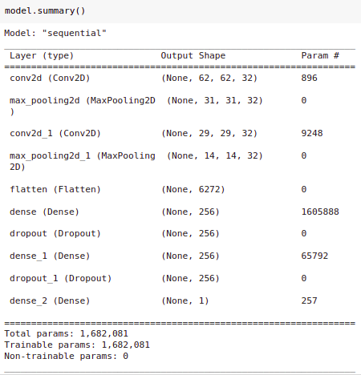
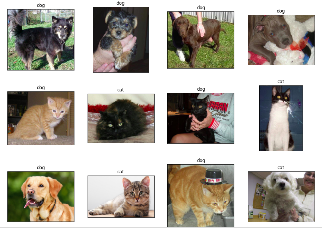
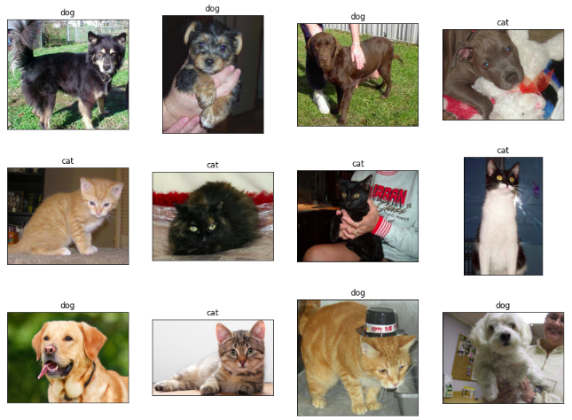

# CNN-cat-dog-classification

** Updated with Dropout and Dense layers units from 128 to 256 neurons.

## Project Description
The project is implementation of cat and dog classification using Convolution Neural Networks (CNN). We can predict any images in the `datasets/single_prediction` directory, and it is need to put any cat and dog image that we want to predict in this directory.

## Dataset
In the training_set & test_set of the dataset, 
* there are 4000 images in the training_set for each cat and dog category, 
* there are 1000 images in the test_set for each cat and dog category
The dataset is provided in the repository

## Model Architecture

`(64, 64, 3)` -> `Convolution2D` ->  `MaxPooling` -> `Convolution2D` -> `MaxPooling` ->  `Flattening` -> `Dense` -> `Dropout` -> `Dense` -> `Dropout` -> `SIGMOID`

* Convolution with `filters=32` and `kernel_size=3` and `activations='relu'`
* MaxPooling with `pool_size=2` and `strides=2`
* The first two Dense layers with `units=256` and `activation='relu'`
* Dropout each first two layer (UPDATE!!!)
* The final Dense layer with `units=1` and `activation=SIGMOID `

Here is the model summary...


## Model Training
```
model.fit(x = training_set, validation_data = test_set, epochs = 100)
```
After traing the model with `100 epochs`
| loss   | accuracy | val-loss | val-accuracy |
| ------ | -------- | -------- | ------------ |
| 0.0471 | 0.9835   | 0.8552   |   0.8105     |

## Predicted result
When we predict on our custom images, the result is as follow.

**Without dropout and Dense layers units 128 neurons, It has four wrong prediction.


**With dropout and Dense layers units 256 neurons, It just has two wrong prediction.


## TO DO
We need to improve prediction result: by hyperparameter tuning OR by improving model architecture...
